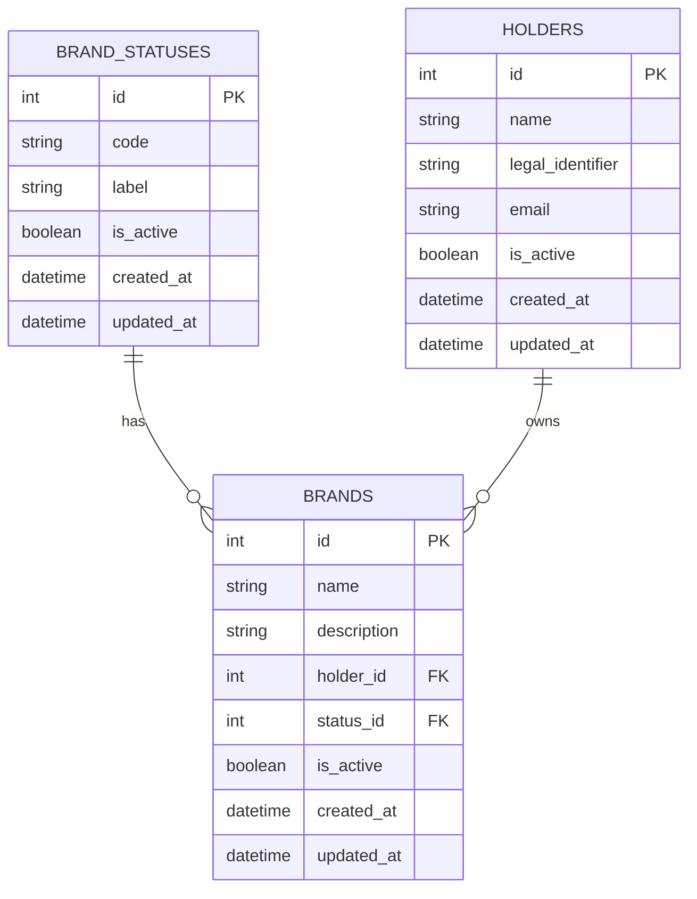

# 🎯 Namerize – Full-Stack Brand Registry System

**Namerize** es un sistema completo de gestión de marcas registradas construido con **FastAPI + SQLAlchemy** en el backend y **Next.js + React** en el frontend.

---

## 🏗️ Arquitectura del proyecto

```
Namerize/
├── Backend/          # API REST con FastAPI
│   ├── main.py       # Servidor FastAPI
│   ├── models.py     # Modelos SQLAlchemy
│   ├── crud.py       # Operaciones CRUD
│   ├── schemas.py    # Schemas Pydantic
│   └── brands.db     # Base de datos SQLite
└── frontend/         # Aplicación Next.js
    ├── src/app/      # App Router de Next.js
    ├── src/components/  # Componentes reutilizables
    └── src/lib/      # Utilidades y configuración
```

---

## ⚙️ Backend - Características principales

- **API REST** en **FastAPI** con documentación interactiva (`/docs` y `/redoc`).
- Modelos con **SQLAlchemy ORM** y **SQLite** como base de datos por defecto.
- **CRUD completo** para:
  - **Brands (marcas)**
  - **Holders (titulares)**
  - **Statuses (estados de marca)**
- **Soft delete** (`is_active`) en todas las entidades → no se eliminan físicamente.
- **Timestamps automáticos**: `created_at` y `updated_at` con actualización inteligente.
- **Paginación** y **búsqueda (search)** en listados de marcas y titulares.
- **Límites de paginación**: máximo 100 registros por página.
- **Seed automático** de estados iniciales: `PENDING`, `ACTIVE`, `INACTIVE`.
- **CORS configurado** para desarrollo local.

---

## 🎨 Frontend - Características principales

### 🛠️ Stack Tecnológico
- **Next.js 15** con App Router
- **React 18** con componentes funcionales y hooks
- **TypeScript** para tipado estático
- **Tailwind CSS** + **CSS Modules personalizados**
- **React Query** para manejo de estado del servidor
- **Ky** como cliente HTTP moderno

### ✨ Características de UI/UX
- **Sistema de diseño personalizado** con CSS modules
- **Glassmorphism** y efectos de backdrop-blur
- **Gradientes temáticos** para cada módulo
- **Responsive design** completo (móvil, tablet, desktop)
- **Animaciones suaves** y micro-interacciones
- **Tipografía fluida** con clamp() para responsividad perfecta
- **Validación de formularios inteligente**
- **Estados de carga** y manejo de errores elegante

### 📱 Secciones del aplicativo

#### 🏠 **Landing Page**
- Página de bienvenida atractiva con call-to-action
- Diseño full-viewport con gradientes de fondo
- Sección de características del sistema
- Navegación fluida hacia la aplicación

#### 🏢 **Gestión de Marcas** (`/brands`)
- **Lista de marcas** con tabla responsive
- **Búsqueda en tiempo real** por nombre/descripción
- **Paginación** con controles intuitivos
- **Formulario de creación** integrado con dropdowns inteligentes
- **Vista de detalles** (`/brands/[id]`) con:
  - Información completa de la marca
  - **Edición inline** sin perder contexto
  - Campos de solo lectura (ID) protegidos
  - Timestamps formateados elegantemente
- **Estados visuales** con badges de colores
- **Validación completa** de formularios
- **Soft delete** con confirmación

#### 👥 **Gestión de Titulares** (`/holders`)
- **Vista de cards** responsive
- **Avatares generados** dinámicamente
- **Formulario integrado** para crear titulares
- **Búsqueda** por nombre, identificación o email
- **Campos obligatorios** con validación en tiempo real
- **Información completa**: nombre, identificación legal, email
- **Acciones rápidas** desde cada card

#### 📊 **Estados de Marca** (`/statuses`)
- **Grid de cards** con información de cada estado
- **Badges coloridos** según el tipo de estado
- **Formulario de creación** con validación de unicidad
- **Códigos automáticos** en mayúsculas
- **Hover effects** y animaciones elegantes
- **Gestión completa** de estados del sistema

#### 🎛️ **Sidebar de Navegación**
- **Sticky positioning** para acceso constante
- **Indicadores visuales** del estado del sistema
- **Estados activos** con gradientes temáticos
- **Iconos intuitivos** para cada sección
- **Información del desarrollador**

---

## 🗃️ Modelo de datos

### BrandStatus
- `id`: int, PK
- `code`: str (ej: `"ACTIVE"`) – **único**
- `label`: str (ej: `"Activa"`)
- `is_active`: bool, default `true`
- `created_at`: datetime (automático)
- `updated_at`: datetime (actualización automática)

### Holder
- `id`: int, PK
- `name`: str, requerido
- `legal_identifier`: str, opcional (ej: NIT, RUC, RFC)
- `email`: str, opcional
- `is_active`: bool, default `true`
- `created_at`: datetime (automático)
- `updated_at`: datetime (actualización automática)

### Brand
- `id`: int, PK
- `name`: str, requerido
- `description`: str, opcional
- `holder_id`: int, FK → `holders.id`
- `status_id`: int, FK → `brand_statuses.id`
- `is_active`: bool, default `true`
- `created_at`: datetime (automático)
- `updated_at`: datetime (actualización automática)
- **Restricciones**:
  - Unicidad: `(name, holder_id)` → un mismo titular no puede registrar la misma marca dos veces.

---

## 🌐 Endpoints disponibles

### Healthcheck
- `GET /health` → `{ "status": "ok" }`

---

### Brands
- `GET /brands`
  - Lista marcas con **paginación** y **search** (`?search=texto&page=1&page_size=10`).
  - **Límite**: máximo 100 registros por página.
  - Por defecto solo devuelve activos (`is_active=true`).
  - Parámetro `include_inactive=true` para incluir inactivos.
  - **Response:**
    ```json
    {
      "items": [...],
      "page": 1,
      "page_size": 10,
      "total": 25
    }
    ```

- `POST /brands`
  - Crea una nueva marca.
  - **Timestamps**: `created_at` se asigna automáticamente.
  - Body:
    ```json
    {
      "name": "ACME HEALTH",
      "description": "Marca para línea de salud",
      "holder_id": 1,
      "status_id": 2
    }
    ```

- `GET /brands/{brand_id}`
  - Obtiene una marca por id.
  - 404 si no existe o está inactiva (a menos que uses `?include_inactive=true`).

- `PUT /brands/{brand_id}`
  - Actualiza campos de una marca (parcial).
  - **Timestamps**: `updated_at` se actualiza automáticamente.
  - Body (ejemplo):
    ```json
    { "name": "ACME HEALTH v2", "status_id": 1 }
    ```

- `DELETE /brands/{brand_id}`
  - **Soft delete**: marca `is_active = false`.
  - **Timestamps**: `updated_at` se actualiza automáticamente.
  - Respuesta: `204 No Content`.

---

### Holders
- `POST /holders`
  - Crea un titular (persona/empresa).
  - **Timestamps**: `created_at` se asigna automáticamente.
  - Body:
    ```json
    {
      "name": "Laboratorios ACME S.A.S",
      "legal_identifier": "900123456-7",
      "email": "legal@acme.co"
    }
    ```

- `GET /holders`
  - Lista titulares con **paginación** y **search** (`?search=acme&page=1&page_size=20`).
  - **Límite**: máximo 100 registros por página.
  - Devuelve solo activos por defecto.
  - Parámetro `include_inactive=true` para incluir inactivos.

- `DELETE /holders/{holder_id}`
  - **Soft delete**: marca `is_active = false`.
  - **Timestamps**: `updated_at` se actualiza automáticamente.
  - Respuesta: `204 No Content`.

---

### Statuses
- `POST /statuses`
  - Crea un nuevo estado.
  - **Timestamps**: `created_at` se asigna automáticamente.
  - Body:
    ```json
    { "code": "SUSPENDED", "label": "Suspendida" }
    ```
  - Restricción: `code` debe ser único.

- `GET /statuses`
  - Lista estados (solo activos por defecto).
  - Parámetro `include_inactive=true` para incluir inactivos.

- `DELETE /statuses/{status_id}`
  - **Soft delete**: marca `is_active = false`.
  - **Timestamps**: `updated_at` se actualiza automáticamente.
  - Respuesta: `204 No Content`.

---

## 🛠️ Instalación y configuración

### Backend (FastAPI)

1. **Clona el repositorio y entra al backend:**
   ```bash
   cd Backend
   ```

2. **Crea y activa el entorno virtual:**
   ```bash
   python -m venv .venv
   .venv\Scripts\activate   # en Windows
   source .venv/bin/activate # en macOS/Linux
   ```

3. **Instala dependencias:**
   ```bash
   pip install -r requirements.txt
   ```

4. **Corre el servidor:**
   ```bash
   python -m uvicorn main:app --reload
   ```

5. **URLs disponibles:**
   - API base: [http://127.0.0.1:8000](http://127.0.0.1:8000)
   - Docs Swagger: [http://127.0.0.1:8000/docs](http://127.0.0.1:8000/docs)
   - Docs ReDoc: [http://127.0.0.1:8000/redoc](http://127.0.0.1:8000/redoc)

---

### Frontend (Next.js)

1. **Entra al directorio del frontend:**
   ```bash
   cd frontend
   ```

2. **Instala dependencias:**
   ```bash
   npm install
   ```

3. **Configura variables de entorno:**
   ```bash
   # Crea el archivo .env.local
   echo "NEXT_PUBLIC_API_URL=http://127.0.0.1:8000" > .env.local
   ```

4. **Inicia el servidor de desarrollo:**
   ```bash
   npm run dev
   ```

5. **Abre en tu navegador:**
   - Aplicación: [http://localhost:3000](http://localhost:3000)

### 🚀 Uso completo del sistema

1. **Inicia el backend** en `http://127.0.0.1:8000`
2. **Inicia el frontend** en `http://localhost:3000`
3. **Navega por la aplicación:**
   - Landing page con información del sistema
   - Gestión completa de marcas con CRUD
   - Administración de titulares
   - Control de estados de marca

---

## 🎯 Características técnicas destacadas

### Backend
- **Timestamps inteligentes**: actualizaciones automáticas en modificaciones y soft deletes
- **Validación robusta**: constraints de base de datos y validación con Pydantic
- **Paginación limitada**: máximo 100 registros para optimizar performance
- **CORS configurado**: desarrollo local sin problemas de origen cruzado

### Frontend
- **CSS Modules personalizados**: sistema de diseño coherente y escalable
- **React Query**: cache inteligente y sincronización con el servidor
- **Validación en tiempo real**: formularios que se validan mientras el usuario escribe
- **Estados de aplicación**: loading, error y success states elegantes
- **Responsive design**: adaptable desde móvil hasta desktop
- **TypeScript**: tipado fuerte para mejor mantenibilidad

---

## 📌 Restricciones y reglas de negocio

- Una marca **no puede duplicarse** para el mismo titular (`UNIQUE (name, holder_id)`).
- El campo `name` en marcas es **obligatorio y no puede ser vacío**.
- El `holder_id` y `status_id` en marcas deben existir.
- **Paginación limitada**: máximo 100 registros por página en todos los endpoints.
- `is_active` se usa para borrados lógicos (soft delete):
  - Las consultas normales solo devuelven registros activos.
  - `DELETE` solo cambia el flag, no elimina físicamente.
  - **Timestamps**: `updated_at` se actualiza al hacer soft delete.
- Los catálogos de estados (`brand_statuses`) se **inicializan automáticamente** con `PENDING`, `ACTIVE`, `INACTIVE`.
- **Frontend**: todos los formularios requieren campos completos antes de habilitar el botón de envío.

---

## 📊 Modelo ER (Mermaid)



**Notas técnicas:**
- **Restricción de unicidad**: `UNIQUE (name, holder_id)` en **BRANDS**.
- **Foreign Keys**: `holder_id` → **HOLDERS.id**; `status_id` → **BRAND_STATUSES.id**.
- **Soft delete**: `is_active` en todas las entidades.
- **Timestamps automáticos**: `created_at` (creación), `updated_at` (modificación y soft delete).

---

## 🤝 Desarrollado por

**Sebastian Wilches** - Full Stack Developer

---

## 🎉 ¡Listo para usar!

El sistema **Namerize** está completamente funcional con una interfaz moderna y una API robusta. ¡Perfecto para gestionar marcas registradas de manera profesional! 🚀