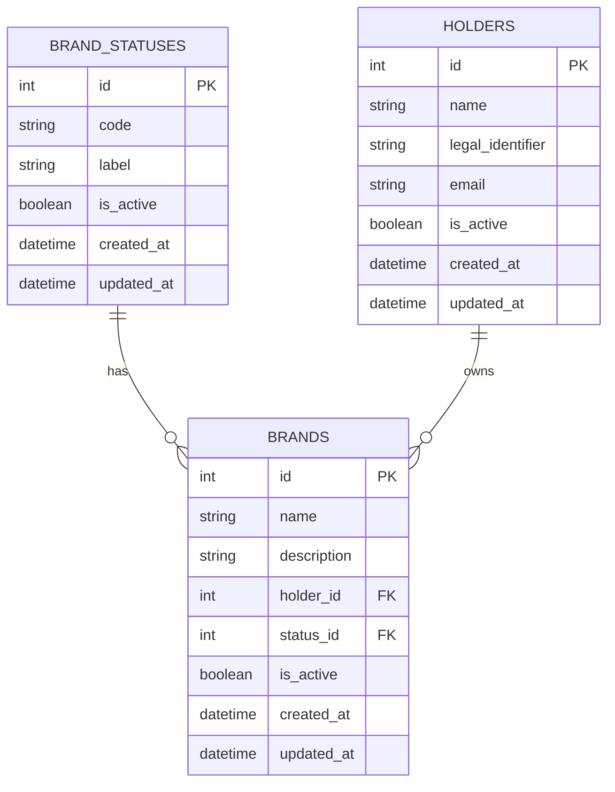

# 📦 Namerize – Brand Registry API

**Namerize** es un proyecto de ejemplo construido con **FastAPI + SQLAlchemy** que permite registrar y gestionar **marcas**.  
Forma parte de una prueba técnica para demostrar habilidades en desarrollo **backend** con Python.

---

## ⚙️ Características principales

- API REST en **FastAPI** con documentación interactiva (`/docs` y `/redoc`).
- Modelos con **SQLAlchemy ORM** y **SQLite** como base de datos por defecto.
- CRUD completo para:
  - **Brands (marcas)**
  - **Holders (titulares)**
  - **Statuses (estados de marca)**
- **Soft delete** (`is_active`) en todas las entidades → no se eliminan físicamente.
- **Timestamps automáticos**: `created_at` y `updated_at` en cada modelo.
- **Paginación** y **búsqueda (search)** en listados de marcas y titulares.
- **Seed automático** de estados iniciales: `PENDING`, `ACTIVE`, `INACTIVE`.

---

## 🗃️ Modelo de datos

### BrandStatus
- `id`: int, PK
- `code`: str (ej: `"ACTIVE"`) – **único**
- `label`: str (ej: `"Activa"`)
- `is_active`: bool, default `true`
- `created_at`: datetime
- `updated_at`: datetime

### Holder
- `id`: int, PK
- `name`: str, requerido
- `legal_identifier`: str, opcional (ej: NIT, RUC, RFC)
- `email`: str, opcional
- `is_active`: bool, default `true`
- `created_at`: datetime
- `updated_at`: datetime

### Brand
- `id`: int, PK
- `name`: str, requerido
- `description`: str, opcional
- `holder_id`: int, FK → `holders.id`
- `status_id`: int, FK → `brand_statuses.id`
- `is_active`: bool, default `true`
- `created_at`: datetime
- `updated_at`: datetime
- **Restricciones**:
  - Unicidad: `(name, holder_id)` → un mismo titular no puede registrar la misma marca dos veces.

---

## 🌐 Endpoints disponibles

### Healthcheck
- `GET /health` → `{ "status": "ok" }`

---

### Brands
- `GET /brands`
  - Lista marcas con **paginación** y **search** (`?search=texto&page=1&page_size=10`).
  - Por defecto solo devuelve activos (`is_active=true`).
  - Parámetro `include_inactive=true` para incluir inactivos.
  - **Response:**
    ```json
    {
      "items": [...],
      "page": 1,
      "page_size": 10,
      "total": 25
    }
    ```

- `POST /brands`
  - Crea una nueva marca.
  - Body:
    ```json
    {
      "name": "ACME HEALTH",
      "description": "Marca para línea de salud",
      "holder_id": 1,
      "status_id": 2
    }
    ```
  - Restricciones:
    - `name` obligatorio.
    - `holder_id` y `status_id` deben existir.
    - `(name, holder_id)` debe ser único.

- `GET /brands/{brand_id}`
  - Obtiene una marca por id.
  - 404 si no existe o está inactiva (a menos que uses `?include_inactive=true`).

- `PUT /brands/{brand_id}`
  - Actualiza campos de una marca (parcial).
  - Body (ejemplo):
    ```json
    { "name": "ACME HEALTH v2", "status_id": 1 }
    ```
  - Restricciones:
    - `name` no puede ser cadena vacía.
    - `holder_id` y `status_id` deben ser válidos.

- `DELETE /brands/{brand_id}`
  - **Soft delete**: marca `is_active = false`.
  - Respuesta: `204 No Content`.

---

### Holders
- `POST /holders`
  - Crea un titular (persona/empresa).
  - Body:
    ```json
    {
      "name": "Laboratorios ACME S.A.S",
      "legal_identifier": "900123456-7",
      "email": "legal@acme.co"
    }
    ```

- `GET /holders`
  - Lista titulares con **paginación** y **search** (`?search=acme&page=1&page_size=20`).
  - Devuelve solo activos por defecto.
  - Parámetro `include_inactive=true` para incluir inactivos.

- `DELETE /holders/{holder_id}`
  - **Soft delete**: marca `is_active = false`.
  - Respuesta: `204 No Content`.

---

### Statuses
- `POST /statuses`
  - Crea un nuevo estado.
  - Body:
    ```json
    { "code": "SUSPENDED", "label": "Suspendida" }
    ```
  - Restricción: `code` debe ser único.

- `GET /statuses`
  - Lista estados (solo activos por defecto).
  - Parámetro `include_inactive=true` para incluir inactivos.

- `DELETE /statuses/{status_id}`
  - **Soft delete**: marca `is_active = false`.
  - Respuesta: `204 No Content`.

---

## 🛠️ Cómo correr el backend

1. Clona el repositorio y entra al backend:
   ```bash
   cd Backend
   ```

2. Crea y activa el entorno virtual:
   ```bash
   python -m venv .venv
   .venv\Scripts\activate   # en Windows
   source .venv/bin/activate # en macOS/Linux
   ```

3. Instala dependencias:
   ```bash
   pip install -r requirements.txt
   ```

4. Corre el servidor:
   ```bash
   python -m uvicorn main:app --reload
   ```

5. Abre en tu navegador:
   - API base: [http://127.0.0.1:8000](http://127.0.0.1:8000)
   - Docs Swagger: [http://127.0.0.1:8000/docs](http://127.0.0.1:8000/docs)
   - Docs ReDoc: [http://127.0.0.1:8000/redoc](http://127.0.0.1:8000/redoc)

---

## 📌 Restricciones y reglas de negocio

- Una marca **no puede duplicarse** para el mismo titular (`UNIQUE (name, holder_id)`).
- El campo `name` en marcas es **obligatorio y no puede ser vacío**.
- El `holder_id` y `status_id` en marcas deben existir.
- `is_active` se usa para borrados lógicos (soft delete):
  - Las consultas normales solo devuelven registros activos.
  - `DELETE` solo cambia el flag, no elimina físicamente.
- Los catálogos de estados (`brand_statuses`) se **inicializan automáticamente** con `PENDING`, `ACTIVE`, `INACTIVE`.

---

## 📊 Modelo ER (Mermaid)



**Notas (fuera del diagrama):**
- Restricción de unicidad: `UNIQUE (name, holder_id)` en **BRANDS**.
- `holder_id` → FK a **HOLDERS.id**; `status_id` → FK a **BRAND_STATUSES.id**.
- Soft delete con `is_active`; timestamps `created_at`, `updated_at`.
